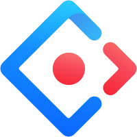
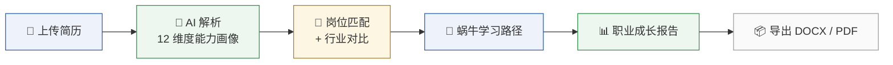

<div align="center">

<picture>
  <source media="(prefers-color-scheme: dark)" srcset="myapp/public/logo.svg">
  
</picture>

<h1>大学生职业规划智能体</h1>

<p>AI 驱动的大学生职业发展平台 — 简历解构 · 岗位匹配 · 学习规划 · 成长报告</p>

<p>
  <a href="https://github.com/innovationpuls-creator/career-planning-agent/stargazers"></a>
  <a href="https://github.com/innovationpuls-creator/career-planning-agent/network"></a>
  <a href="https://github.com/innovationpuls-creator/career-planning-agent/issues"></a>
  <a href="./LICENSE"></a>
  <a href="https://github.com/innovationpuls-creator/career-planning-agent/commits/main"></a>
  <a href="https://github.com/innovationpuls-creator/career-planning-agent"></a>
</p>

<!-- TODO: add deployment URL when available -->
<p>
  <a href="#">Live Demo</a> &nbsp;&nbsp;·&nbsp;&nbsp;
  <a href="#-quick-start">Quick Start</a> &nbsp;&nbsp;·&nbsp;&nbsp;
  <a href="./docs/api-contract.md">Docs</a> &nbsp;&nbsp;·&nbsp;&nbsp;
  <a href="https://github.com/innovationpuls-creator/career-planning-agent/issues">Report Bug</a>
</p>

</div>

---

##  Preview

<p align="center">
  <em>TODO: 添加产品截图</em><br/>
  <code>docs/images/preview-home.png</code> &nbsp;|&nbsp;
  <code>docs/images/preview-profile.png</code> &nbsp;|&nbsp;
  <code>docs/images/preview-report.png</code>
</p>

---

##  Core Workflow



---

##  Feature Cards

<table align="center">
  <tr>
    <td align="center" width="33%">
      <strong>📄 简历解构</strong><br/>
      <sub>上传简历 → AI 自动解析为 12 维度能力画像，支持流式对话修改</sub>
    </td>
    <td align="center" width="33%">
      <strong>🗺️ 岗位能力图谱</strong><br/>
      <sub>Neo4j 知识图谱可视化展示岗位能力要求，可交互探索</sub>
    </td>
    <td align="center" width="33%">
      <strong>🏢 同岗行业对比</strong><br/>
      <sub>同一岗位跨行业、跨公司的薪资与要求横向对比</sub>
    </td>
  </tr>
  <tr>
    <td align="center" width="33%">
      <strong>🎯 岗位智能匹配</strong><br/>
      <sub>基于向量相似度的个人能力 × 岗位要求匹配，支持收藏</sub>
    </td>
    <td align="center" width="33%">
      <strong>🐌 蜗牛学习路径</strong><br/>
      <sub>三阶段（短/中/长期）成长规划 + 周/月复盘 + 里程碑追踪</sub>
    </td>
    <td align="center" width="33%">
      <strong>📊 职业成长报告</strong><br/>
      <sub>AI 生成个性化报告，富文本编辑，导出 MD / DOCX / PDF</sub>
    </td>
  </tr>
</table>

---

##  Tech Stack

**Frontend**


**Backend**


**Data**


---

##  Quick Start

```bash
# 1. Clone
git clone https://github.com/innovationpuls-creator/career-planning-agent.git
cd career-planning-agent

# 2. Backend
cd backend && cp .env.example .env && uv sync
uv run uvicorn app.main:app --reload --host 127.0.0.1 --port 9100

# 3. Frontend
cd ../myapp && npm install && npm start     # → http://localhost:8000

# 4. Init data (first time only)
cd ../backend && uv run python scripts/rebuild_job_transfer_v2.py --with-import
```

> AI 功能（简历解析 / 报告生成 / 岗位匹配）需在 `.env` 中配置 LLM / Dify / Embedding 凭据。不配置可启动基础服务。

---

##  Project Structure

```
career-planning-agent/
├── backend/
│   ├── app/
│   │   ├── api/          # FastAPI routers
│   │   ├── services/     # LLM, embedding, Dify, vector store
│   │   ├── models/       # SQLAlchemy ORM
│   │   └── schemas/      # Pydantic DTOs
│   └── tests/
├── myapp/
│   ├── src/
│   │   ├── pages/        # Route pages
│   │   ├── services/     # API client
│   │   └── components/   # Shared UI
│   └── config/
└── docs/
    ├── api-contract.md
    └── DESIGN_SYSTEM_SPEC.md
```

---

<details>
<summary>📋 环境变量说明</summary>

| 变量 | 说明 | 必填 |
|------|------|------|
| `APP_SECRET_KEY` | JWT 签名密钥 | ✅ |
| `LLM_BASE_URL` / `LLM_API_KEY` / `LLM_MODEL` | 大模型接口 | AI 功能 |
| `DIFY_BASE_URL` / `DIFY_API_KEY` | Dify 工作流 | 简历解析 / 报告生成 |
| `EMBEDDING_BASE_URL` / `EMBEDDING_API_KEY` | 向量嵌入 | 岗位匹配 |
| `NEO4J_URI` / `NEO4J_USERNAME` / `NEO4J_PASSWORD` | 图数据库 | 知识图谱 |
| `QDRANT_PATH` | 向量库路径 | 相似度搜索 |

完整配置见 `backend/.env.example`。
</details>

<details>
<summary>🗺️ Roadmap</summary>

- [x] 12 维度简历 AI 解析
- [x] 岗位知识图谱（Neo4j + G6 可视化）
- [x] 同岗行业纵向对比
- [x] 岗位向量匹配 + 收藏
- [x] 蜗牛学习路径三阶段规划
- [x] 个人职业成长报告（AI 生成 + 导出 DOCX/PDF）
- [x] 管理后台（用户管理 / 数据看板）
- [ ] 移动端适配
- [ ] 岗位投递追踪
- [ ] 导师 / 辅导员视角

</details>

<details>
<summary>📖 API 文档</summary>

所有接口规范见 [`docs/api-contract.md`](./docs/api-contract.md)，按页面分组，包含请求/响应示例、SSE 流格式和错误码约定。

后端启动后 Swagger UI：`http://127.0.0.1:9100/docs`。
</details>

---

<div align="center">
  <sub>Licensed under <a href="./LICENSE">Apache 2.0</a></sub>
</div>
