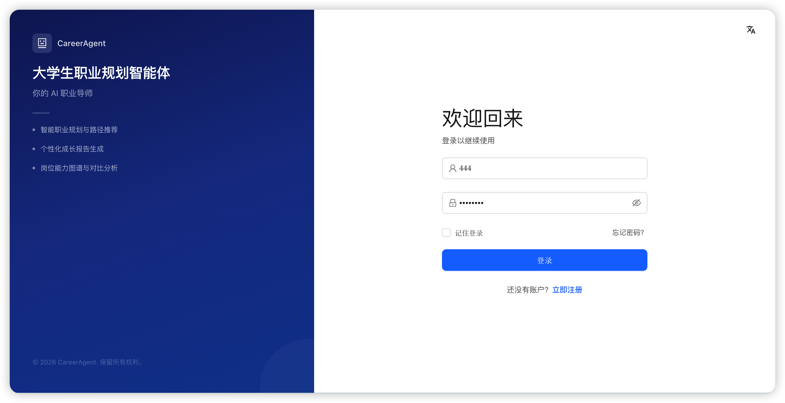
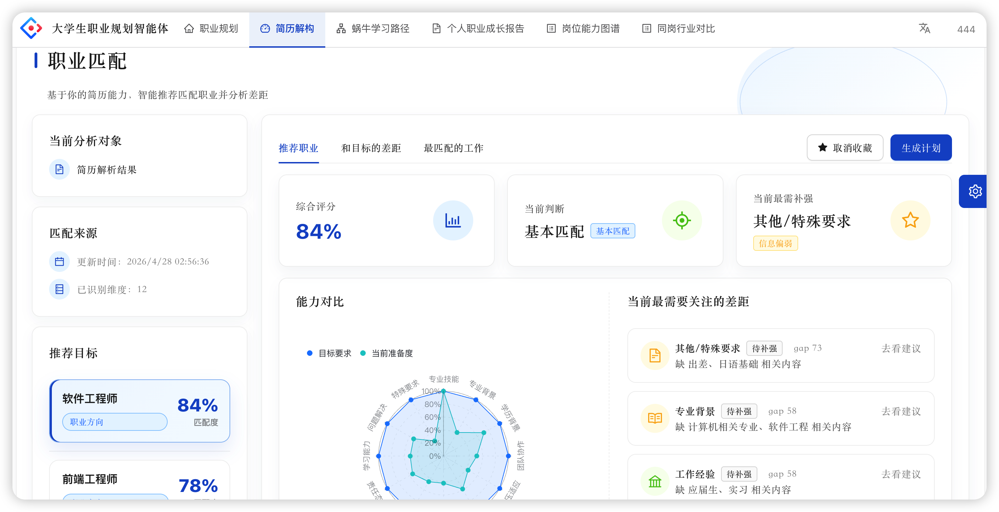
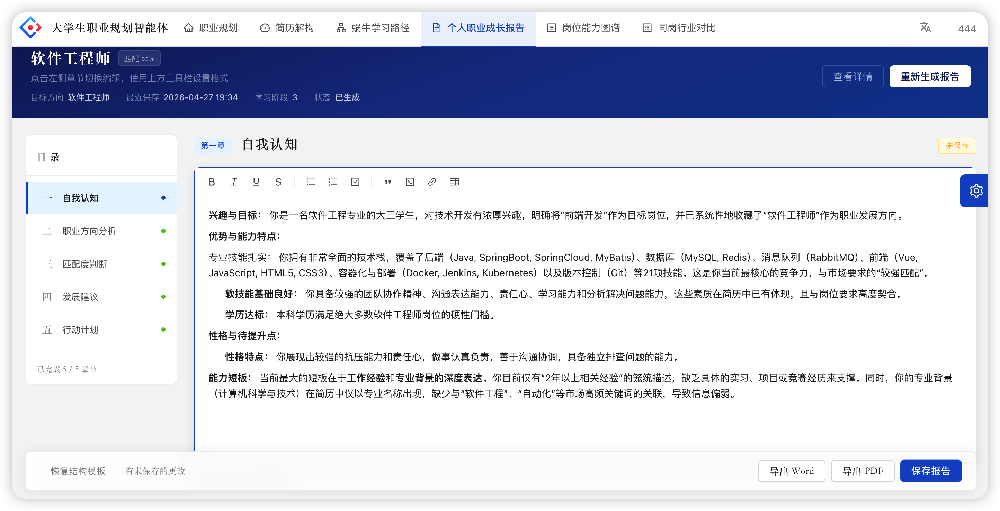
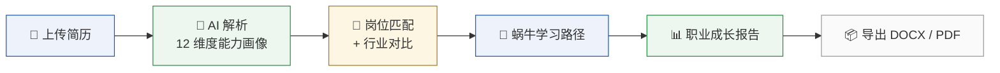

<div align="center">

<picture>
  <source media="(prefers-color-scheme: dark)" srcset="myapp/public/logo.svg">
  
</picture>

<h1>大学生职业规划智能体</h1>

<p>AI 驱动的大学生职业发展平台 — 简历解构 · 岗位匹配 · 学习规划 · 成长报告</p>

<p>
  <a href="https://github.com/innovationpuls-creator/career-planning-agent/stargazers"></a>
  <a href="https://github.com/innovationpuls-creator/career-planning-agent/network"></a>
  <a href="https://github.com/innovationpuls-creator/career-planning-agent/issues"></a>
  <a href="./LICENSE"></a>
  <a href="https://github.com/innovationpuls-creator/career-planning-agent/commits/main"></a>
  <a href="https://github.com/innovationpuls-creator/career-planning-agent"></a>
</p>

<!-- TODO: add deployment URL when available -->
<p>
  <a href="#">Live Demo</a> &nbsp;&nbsp;·&nbsp;&nbsp;
  <a href="#-quick-start">Quick Start</a> &nbsp;&nbsp;·&nbsp;&nbsp;
  <a href="./docs/api-contract.md">Docs</a> &nbsp;&nbsp;·&nbsp;&nbsp;
  <a href="https://github.com/innovationpuls-creator/career-planning-agent/issues">Report Bug</a>
</p>

</div>

---

##  Preview

<p align="center">
  
  
  
</p>

---

##  Core Workflow



---

##  Feature Cards

<table align="center">
  <tr>
    <td align="center" width="33%">
      <strong>📄 简历解构</strong><br/>
      <sub>上传简历 → AI 自动解析为 12 维度能力画像，支持流式对话修改</sub>
    </td>
    <td align="center" width="33%">
      <strong>🗺️ 岗位能力图谱</strong><br/>
      <sub>Neo4j 知识图谱可视化展示岗位能力要求，可交互探索</sub>
    </td>
    <td align="center" width="33%">
      <strong>🏢 同岗行业对比</strong><br/>
      <sub>同一岗位跨行业、跨公司的薪资与要求横向对比</sub>
    </td>
  </tr>
  <tr>
    <td align="center" width="33%">
      <strong>🎯 岗位智能匹配</strong><br/>
      <sub>基于向量相似度的个人能力 × 岗位要求匹配，支持收藏</sub>
    </td>
    <td align="center" width="33%">
      <strong>🐌 蜗牛学习路径</strong><br/>
      <sub>三阶段（短/中/长期）成长规划 + 周/月复盘 + 里程碑追踪</sub>
    </td>
    <td align="center" width="33%">
      <strong>📊 职业成长报告</strong><br/>
      <sub>AI 生成个性化报告，富文本编辑，导出 MD / DOCX / PDF</sub>
    </td>
  </tr>
</table>

---

##  Tech Stack

**Frontend**


**Backend**


**Data**


---

##  Quick Start

> **系统要求**：Python 3.13+、Node.js 18+、包管理器 [uv](https://docs.astral.sh/uv/)、以及 [Neo4j](https://neo4j.com/download/) 和 [Qdrant](https://qdrant.tech/documentation/quick-start/)。以下按平台展开安装流程。

---

###  macOS 环境

#### 1. 安装基础工具

```bash
# Homebrew（如未安装）
/bin/bash -c "$(curl -fsSL https://raw.githubusercontent.com/Homebrew/install/HEAD/install.sh)"

# Python 3.13
brew install python@3.13

# uv 包管理器
brew install uv
# 或: pip3 install uv

# Node.js 18+
brew install node@18
```

#### 2. 安装 Neo4j（图数据库）

```bash
brew install neo4j
brew services start neo4j       # 启动服务，开机自启
# 验证: 浏览器打开 http://localhost:7474，默认用户名/密码 neo4j/neo4j
# 首次登录会要求修改密码，请确保与后续 .env 的 NEO4J_PASSWORD 一致
```

#### 3. 安装 Qdrant（向量数据库）

**方式 A — 使用项目自带的二进制（ARM Mac 推荐）**  
项目 `backend/qdrant-bin/qdrant` 已包含 macOS ARM64 二进制，后端启动时会自动拉起。

**方式 B — 使用 Docker**  
```bash
docker pull qdrant/qdrant
docker run -d --name qdrant \
  -p 6333:6333 -p 6334:6334 \
  -v $(pwd)/backend/data/qdrant:/qdrant/storage \
  qdrant/qdrant
```

> 使用方式 A 时无需额外操作；使用方式 B 时需在启动后端前保证容器已运行。

#### 4. 配置环境变量

```bash
cd backend
cp .env.example .env
# 编辑 .env，至少填写:
#   APP_SECRET_KEY=任意长随机字符串
#   NEO4J_PASSWORD=你在步骤 2 中设置的密码
# AI 功能（简历解析/报告生成/岗位匹配）需额外配置 LLM / Dify / Embedding 凭据
```

#### 5. 初始化后端（Python 依赖 + 数据库）

```bash
cd backend
uv sync                                   # 安装 Python 依赖
uv run uvicorn app.main:app --reload --host 127.0.0.1 --port 9100
# 首次启动会自动:
#   - 创建 data/app.db（SQLite）
#   - 如果 Neo4j 未运行则自动 brew services start
#   - 如果 Qdrant 未运行则自动启动 qdrant-bin/qdrant
#   - 创建所有数据库表
#   - 同步岗位知识图谱到 Neo4j
#   - 种子管理员账号（admin / admin123）
```

#### 6. 初始化前端

```bash
cd myapp
npm install
npm start                                 # → http://localhost:8000
# API 代理配置在 config/proxy.ts，自动转发到 :9100
```

#### 7. 导入初始数据（首次运行）

```bash
cd backend
# 参数 --data-source-dir 指向行业数据文件夹，默认 Windows 路径
# macOS 请指定实际数据目录
uv run python scripts/rebuild_job_transfer_v2.py --with-import \
  --data-source-dir /path/to/行业数据
```

---

###  Windows 环境

#### 1. 安装基础工具

```powershell
# Python 3.13
# 下载 https://www.python.org/downloads/ → 安装时勾选 "Add to PATH"

# uv 包管理器
powershell -c "irm https://astral.sh/uv/install.ps1 | iex"
# 或: pip install uv

# Node.js 18+
# 下载 https://nodejs.org/ → LTS 版本安装
```

#### 2. 安装 Neo4j（图数据库）

Neo4j 在 Windows 上以**系统服务**运行：

1. 下载 **Neo4j Community Edition**：https://neo4j.com/download-center/
2. 选择 **Windows** 版本 → 运行安装程序
3. 安装后以管理员身份打开 PowerShell：

```powershell
# 注册为 Windows 服务（以 v5 为例，路径根据实际安装位置调整）
& "C:\Program Files\Neo4j\bin\neo4j.ps1" install-service
& "C:\Program Files\Neo4j\bin\neo4j.ps1" start
```

4. 浏览器打开 `http://localhost:7474`，默认用户名/密码 `neo4j/neo4j`
5. 首次登录会要求修改密码，请同步更新 `.env` 中的 `NEO4J_PASSWORD`

#### 3. 安装 Qdrant（向量数据库）

Windows 上推荐使用 Docker Desktop：

```powershell
# 安装 Docker Desktop: https://docs.docker.com/desktop/setup/install/windows-install/
docker pull qdrant/qdrant
docker run -d --name qdrant ^
  -p 6333:6333 -p 6334:6334 ^
  -v ${PWD}\backend\data\qdrant:/qdrant/storage ^
  qdrant/qdrant
```

> 如不使用 Docker，可从 [Qdrant Releases](https://github.com/qdrant/qdrant/releases) 下载 Windows 二进制，手动启动。

#### 4. 配置环境变量

```powershell
cd backend
copy .env.example .env
# 编辑 .env，至少填写:
#   APP_SECRET_KEY=任意长随机字符串
#   NEO4J_PASSWORD=你在步骤 2 中设置的密码
```

#### 5. 初始化后端

```powershell
cd backend
uv sync                                                  # 安装 Python 依赖
uv run uvicorn app.main:app --reload --host 127.0.0.1 --port 9100
# 首次启动会自动创建 SQLite 数据库和表
# 注意: Windows 上需在启动后端前自行确保 Neo4j 和 Qdrant 已运行
```

#### 6. 初始化前端

```powershell
cd myapp
npm install
npm start                                                # → http://localhost:8000
```

#### 7. 导入初始数据（首次运行）

```powershell
cd backend
uv run python scripts/rebuild_job_transfer_v2.py --with-import
# 默认数据源: C:\Users\yzh\Desktop\feature_map\行业数据
# 如路径不符，修改 DEFAULT_SOURCE_DIR 或使用 --data-source-dir
```

---

###  Docker 方式（跨平台）

> 项目正在规划 Docker 化支持（详见 [Docker 可行性分析](#)），目前可手动将 Neo4j 和 Qdrant 跑在容器中，后端和前端在宿主机运行：

```bash
# Neo4j 容器
docker run -d --name neo4j \
  -p 7474:7474 -p 7687:7687 \
  -e NEO4J_AUTH=neo4j/yourpassword \
  neo4j:5

# Qdrant 容器
docker run -d --name qdrant \
  -p 6333:6333 -p 6334:6334 \
  qdrant/qdrant

# 后端和前端仍在宿主机直接运行（同一项目 macOS / Windows 步骤）
```

---

###  验证是否成功

| 检查项 | 地址 | 说明 |
|--------|------|------|
| 前端页面 | `http://localhost:8000` | 能看到登录页 |
| 后端 API | `http://localhost:9100/docs` | Swagger 文档可访问 |
| Neo4j | `http://localhost:7474` | Browser 可登录查询 |
| Qdrant | `http://localhost:6333/healthz` | 返回 `OK` |
| 管理员登录 | 前端使用 admin/admin123 | 能进入管理后台 |

---

###  常见问题

**Q: 启动后端时提示 "Neo4j is not running"？**  
A: 确认 Neo4j 服务已启动。macOS 执行 `brew services list | grep neo4j`，Windows 检查 Windows 服务管理器。

**Q: Qdrant 端口 6333 被占用？**  
A: 检查已有进程并关闭，或修改 `.env` 中 Qdrant 配置的端口。

**Q: SQLite 文件在哪？**  
A: `backend/data/app.db`，首次启动后端时自动创建。删除此文件可重置所有数据。

**Q: 不需要默认种子数据？**  
A: 可以跳过第 7 步的数据导入。岗位匹配和知识图谱功能将不可用，但简历解析、学习路径等基础功能仍可正常使用。

---

##  Project Structure

```
career-planning-agent/
├── backend/
│   ├── app/
│   │   ├── api/          # FastAPI routers
│   │   ├── services/     # LLM, embedding, Dify, vector store
│   │   ├── models/       # SQLAlchemy ORM
│   │   └── schemas/      # Pydantic DTOs
│   └── tests/
├── myapp/
│   ├── src/
│   │   ├── pages/        # Route pages
│   │   ├── services/     # API client
│   │   └── components/   # Shared UI
│   └── config/
└── docs/
    ├── api-contract.md
    └── DESIGN_SYSTEM_SPEC.md
```

---

<details>
<summary>📋 环境变量说明</summary>

| 变量 | 说明 | 必填 |
|------|------|------|
| `APP_SECRET_KEY` | JWT 签名密钥 | ✅ |
| `LLM_BASE_URL` / `LLM_API_KEY` / `LLM_MODEL` | 大模型接口 | AI 功能 |
| `DIFY_BASE_URL` / `DIFY_API_KEY` | Dify 工作流 | 简历解析 / 报告生成 |
| `EMBEDDING_BASE_URL` / `EMBEDDING_API_KEY` | 向量嵌入 | 岗位匹配 |
| `NEO4J_URI` / `NEO4J_USERNAME` / `NEO4J_PASSWORD` | 图数据库 | 知识图谱 |
| `QDRANT_PATH` | 向量库路径 | 相似度搜索 |

完整配置见 `backend/.env.example`。
</details>

<details>
<summary>🗺️ Roadmap</summary>

- [x] 12 维度简历 AI 解析
- [x] 岗位知识图谱（Neo4j + G6 可视化）
- [x] 同岗行业纵向对比
- [x] 岗位向量匹配 + 收藏
- [x] 蜗牛学习路径三阶段规划
- [x] 个人职业成长报告（AI 生成 + 导出 DOCX/PDF）
- [x] 管理后台（用户管理 / 数据看板）
- [ ] 移动端适配
- [ ] 岗位投递追踪
- [ ] 导师 / 辅导员视角

</details>

<details>
<summary>📖 API 文档</summary>

所有接口规范见 [`docs/api-contract.md`](./docs/api-contract.md)，按页面分组，包含请求/响应示例、SSE 流格式和错误码约定。

后端启动后 Swagger UI：`http://127.0.0.1:9100/docs`。
</details>

---

<div align="center">
  <sub>Licensed under <a href="./LICENSE">Apache 2.0</a></sub>
</div>
